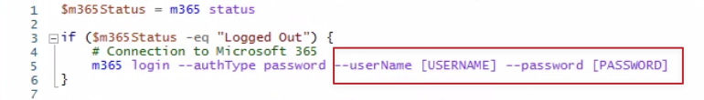
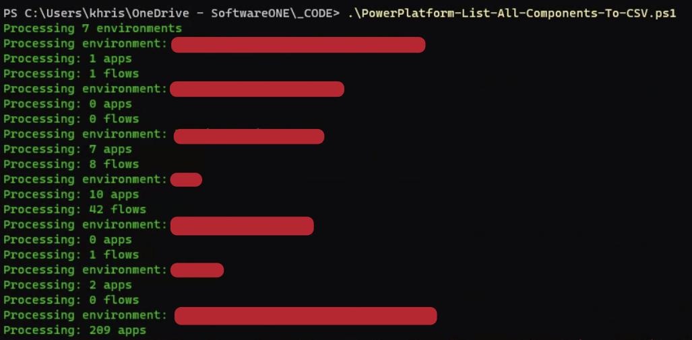

# COMPONENT INVENTORY

## Pre-requisites

 1. PowerShell 7
 2. CLI for Microsoft 365
 3. Login credentials with at least the Power Platform Admin role

## Instructions
1. Save the attached PowerShell script.
*The script only lists PowerApps and Power Automate flows to a local .CSV file for inventory purposes.*

2. Edit the .ps1 file. Specify the username and password.
*If you prefer to change the authenticate type, please feel free: https://pnp.github.io/cli-microsoft365/cmd/login*

3. Save the file.

4. Launch Windows PowerShell

5. Navigate to the location where you saved the .ps1 file

6. Type the name of the .ps1 file (use tab to autocomplete)

7. Execute the script

8. You may receive the following error if this is your first time running PnP. If not, please skip to step 12. 
>> Error: invalid_grant: AADSTS65001: The user or administrator has not consented to use the application with ID '31359c7f-bd7e-475c-86db-fdb8c937548e' named 'PnP Management Shell'. Send an interactive authorization request for this user and resource. 
9. If you do, please run the Register-PnPManagementShellAccess cmd as a Global Admin.
You’ll be prompted to consent to a set of permissions. Consent on behalf of your organization and click on the Accept button.

10. Retry executing the script once consent has been accepted. 

11. The script will display progress as it crawls through your Power Platform environments

12. Once you see **** INVENTORY DISCOVERY COMPLETE **** on the console screen, a .csv file will be generated in the same location (filename: PowerPlatform-Export-ALL.csv)

13. Please send us the file for review. If you run into any issues executing the script, please let us know so we can assist accordingly.

# Storage Capacity Overview

## Pre-requisites

- Login credentials with at least the Power Platform Admin role

## Instructions

1. Navigate to the Power Platform Admin Center: Power Platform admin center (microsoft.com)

2. Navigate to Resources > Capacity

3. Take screenshots of the Dataverse and Microsoft Teams tabs

4. Please send us the screenshots for review
